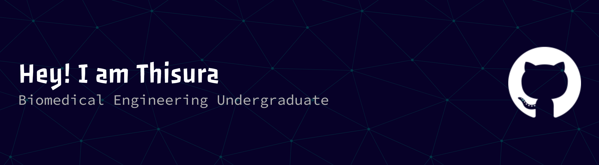

## Thisura Samuditha Arachchige

## About
I am a Biomedical Engineering Undergraduate. I am passionate about **Biomechanics in sports, Machine Learning, Biomedical signal processing, HCI.** As a sports enthusiast I am very much into improving athletes' performance by using biomechanics and data analysis, injury prevention.

## Socials:
 
 

## Tech Stack:
 
 

 
 

## Projects:
- **DVT Prevention Device using EMS/TENS (Ongoing)**  
- **Smart Urine Monitoring Device**  
- **Smart Spacer**  
- **Analog Voice over Device**  
