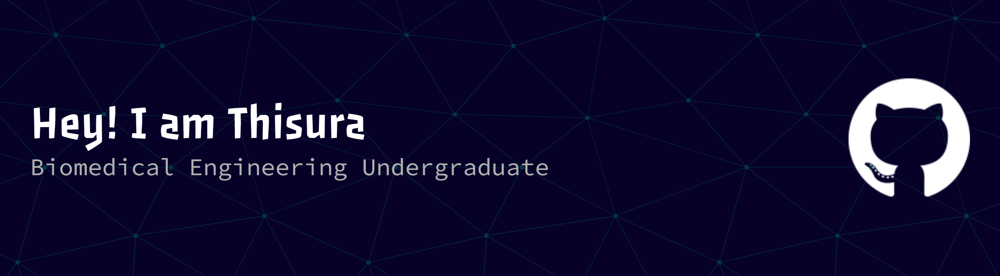

## Thisura Samuditha Arachchige

I am a third-year Biomedical Engineering undergraduate at the University of Moratuwa, Sri Lanka, with a strong focus on developing advanced and innovative solutions to healthcare challenges. I have hands-on experience in embedded systems, medical-grade stimulation projects, and navigating ethical clearance processes. My technical background spans biomechanics, physiological system modelling, signal processing, hardware design, and machine learning, all applied toward practical biomedical applications.

## Areas of Interest:
- Biomechanics,Neuromechanics & Rehabilitation
- Motion Analysis for Sports High Performance
- Human Computer Interaction
- Myoelectric Devices
- Signal processing 
- Wearable Devices 
- Hardware design  
- Machine learning for Healthcare Applications

## Socials:
 
 

## Tech Stack:
 
 

 
 

## Projects:
- **DVT Prevention Device using EMS/TENS (Ongoing)**  
- **Smart Urine Monitoring Device**  
- **Smart Spacer**  
- **Analog Voice over Device**  
